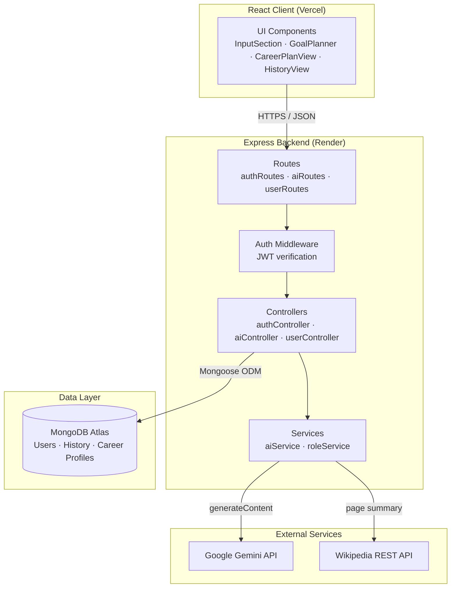
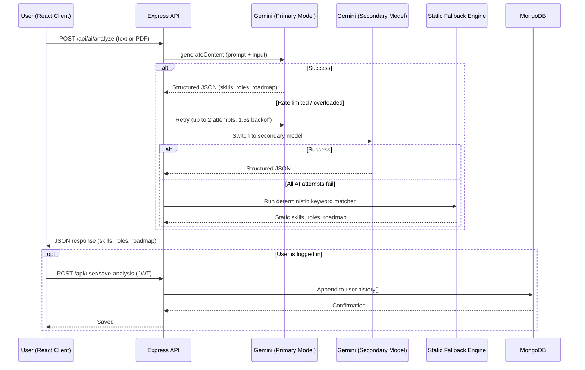

# Skill2Career Engine 

**An AI-powered career guidance platform** that analyzes a user's resume or self-reported skills, matches them against real-world job roles, and generates a personalized, phase-by-phase roadmap — missing skills, project ideas, and companies hiring — to close the gap. Built on the MERN stack and powered by Google's Gemini API, with a fully deterministic offline fallback engine so the product never leaves a user with a broken screen.


**Live:** Backend deployed on **[Render](https://render.com)** · Frontend deployed on **[Vercel](https://vercel.com)**

[](https://nodejs.org/)
[](https://expressjs.com/)
[](https://react.dev/)
[](https://www.mongodb.com/atlas)
[](https://ai.google.dev/)

---

## Table of Contents

- [Introduction](#introduction)
- [Demo](#demo)
- [Setup & Run Instructions](#setup--run-instructions)
- [Environment Variables](#environment-variables)
- [Model, Embedding, Framework & Storage](#model-embedding-framework--storage)
- [Architecture](#architecture)
- [How It Works](#how-it-works)
- [Document Precedence Rules](#document-precedence-rules)
- [Privacy & Safety](#privacy--safety)
- [What I'd Improve Before Production](#what-id-improve-before-production)
- [Frequently Asked Questions](#frequently-asked-questions)

---

## Introduction

Skill2Career Engine helps a user answer two practical questions:

1. **"Given my current skills or resume, which job roles am I closest to — and what exactly am I missing?"**
2. **"If I want to become an X in Y months, what's the concrete plan — skills, projects, and companies — to get there?"**

A user can either paste their skills/resume as text or upload a PDF resume. The backend sends this content to Google's **Gemini API**, which returns a structured analysis: matched roles, a match percentage, missing skills, and a learning roadmap. If the AI call fails for any reason — a missing key, a rate limit, or a network error — the application transparently falls back to a deterministic, keyword-matching rule engine, so the experience degrades gracefully instead of breaking. Authenticated users can additionally save their analysis history and a persistent "career profile" to MongoDB, while unauthenticated users can use the core analysis flow in a **Guest Mode**.

---

## Demo

| Layer | Platform | Notes |
|---|---|---|
| **Backend (API)** | [Render](https://render.com) | Node.js/Express service, connected to MongoDB Atlas |
| **Frontend (Client)** | [Vercel](https://vercel.com) | React app built with Create React App |

> To point your own Vercel deployment at your own Render backend, update `client/src/config.js` with your Render service URL (see [Setup & Run Instructions](#setup--run-instructions)).

---

## Setup & Run Instructions

### Prerequisites

- **Node.js** v18 or higher
- **npm**
- A **MongoDB** instance (local, or a free [MongoDB Atlas](https://www.mongodb.com/atlas) cluster)
- A **Google Gemini API key** ([get one here](https://ai.google.dev/))

### 1. Clone the repository

```bash
git clone https://github.com/Gunjannnn30/skill2career-engine.git
cd skill2career-engine
```

### 2. Backend setup

Install dependencies from the project root:

```bash
npm install
```

Create a `.env` file in the project root:

```env
PORT=5000
MONGO_URI=your_mongodb_connection_string
JWT_SECRET=your_jwt_secret
GEMINI_API_KEY=your_gemini_api_key
```

Start the server:

```bash
npm start
```

or, for development:

```bash
npm run dev
```

The API will be available at `http://localhost:5000`.

### 3. Frontend setup

In a separate terminal:

```bash
cd client
npm install
npm start
```

This starts the React development server, typically at `http://localhost:3000`. In development, the client automatically targets `http://localhost:5000` for API calls.

### 4. Build the frontend for production

```bash
cd client
npm run build
```

This produces a static `build/` folder ready to deploy to Vercel (or any static host). Before building for your own deployment, update the production API URL in `client/src/config.js` to point to your own Render (or other) backend URL.

---

## Environment Variables

All backend variables are loaded via `dotenv` in `server.js`.

| Variable | Required | Used In | Purpose |
|---|---|---|---|
| `PORT` | No — defaults to `5000` | `server.js` | Port the Express server listens on |
| `MONGO_URI` | Yes | `config/db.js` | MongoDB connection string (used by Mongoose) |
| `JWT_SECRET` | Yes | `controllers/authController.js`, `middleware/authMiddleware.js` | Secret key used to sign and verify JWTs |
| `GEMINI_API_KEY` | Yes | `services/aiService.js`, `controllers/aiController.js` | API key for Google's Gemini API |
| `AI_API_KEY` | No | Same as above | Alternate name for the Gemini key — the code checks `GEMINI_API_KEY \|\| AI_API_KEY`, so either works |

Create a `.env` file in the project root before running the backend; it is not committed to the repository.

---

## Model, Embedding, Framework & Storage

| Category | Detail |
|---|---|
| **AI Model** | Google **Gemini**, called directly via REST (`generativelanguage.googleapis.com`) using the native `fetch` API. Primary model: `gemini-3.1-flash-lite`. Secondary model: `gemini-2.5-flash`, used automatically if the primary is rate-limited or overloaded. |
| **Embeddings** | None used. All matching is performed either by prompting Gemini to reason directly over raw text, or — in the fallback path — via plain keyword/substring matching. There is no vector database or semantic search layer. |
| **Backend Framework** | Node.js + **Express.js** |
| **Frontend Framework** | **React** (Create React App / `react-scripts`), with `lucide-react` for icons and `jspdf` for client-side PDF export |
| **Database** | **MongoDB**, accessed via the **Mongoose** ODM. Stores user accounts, hashed passwords, analysis history, and each user's active career profile. |
| **File Storage** | None. Uploaded resume PDFs are processed entirely **in memory** (via `multer.memoryStorage()`) and are never written to disk or a database — only the extracted text and resulting analysis are optionally saved. |
| **Auth** | Stateless **JWT** authentication, with passwords hashed using `bcryptjs`. |

---

## Architecture



### Directory Structure

```
skill2career-engine/
├── server.js                  # Express app entrypoint, route mounting, global error handling
├── config/
│   └── db.js                  # Mongoose connection setup
├── models/
│   └── User.js                # User schema: auth fields + history[] + careerProfile
├── middleware/
│   └── authMiddleware.js      # JWT verification ("protect" middleware)
├── controllers/
│   ├── authController.js      # register / login
│   ├── aiController.js        # analyze / upload-resume / career-details / goal-analysis
│   └── userController.js      # save-analysis / history / career-profile (CRUD)
├── routes/
│   ├── authRoutes.js          # /api/auth/*
│   ├── aiRoutes.js            # /api/ai/*  (includes multer PDF upload)
│   └── userRoutes.js          # /api/user/*  (all protected)
├── services/
│   ├── aiService.js           # Gemini integration + retry/fallback logic + static keyword engine
│   └── roleService.js         # Static rules-based role matcher (used only as fallback)
└── client/                    # React frontend (Create React App)
    └── src/
        ├── App.js             # Top-level state/routing (guest mode, views, API calls)
        ├── config.js           # API_BASE_URL (environment-dependent)
        └── components/         # InputSection, GoalPlanner, CareerModal, HistoryView, etc.
```

Authentication is stateless: `authMiddleware.protect` reads the `Authorization: Bearer <token>` header, verifies it against `JWT_SECRET`, and attaches the resolved user to `req.user`. The `/api/ai/*` routes are intentionally left unprotected so that Guest Mode works without login; only the `/api/user/*` routes require a valid token.

---

## How It Works



### 1. Input

A user either types free-text skills or resume content, or uploads a PDF resume, which is parsed server-side into raw text using `pdf-parse`.

### 2. Skill & Role Analysis — `POST /api/ai/analyze` or `/api/ai/upload-resume`

The extracted text is sent to Gemini with a strict, JSON-only prompt asking for:
- A list of extracted `skills`
- Three to five candidate `roles`, each with a `match` percentage, `missingSkills`, and a step-by-step `roadmap`

The response is stripped of any markdown code fences and parsed as JSON, and results are capped at the top five roles. If the AI call fails, the request falls back to a local, deterministic engine:
- `analyzeText()` matches against roughly 30 hardcoded skill keywords using substring search
- `matchRoles()` scores the user against four hardcoded role definitions (Backend Developer, Frontend Developer, Full-Stack Developer, Software Engineer) by simple keyword overlap

### 3. Career Details — `POST /api/ai/career-details`

Given a role name, the backend first fetches a short summary from the **Wikipedia REST API**, then feeds that context into Gemini to produce a structured breakdown: responsibilities, market outlook, hiring companies, an average salary range, top-1%-portfolio guidance, and example project ideas. If Gemini fails, the endpoint still returns the Wikipedia extract plus generic static content, and includes an `aiEnhanced: true/false` flag so the client can reflect the confidence level of the response.

### 4. Goal-Based Roadmap — `POST /api/ai/goal-analysis`

Given a target role, a timeline, current skills, and completed projects, Gemini is prompted to produce an exhaustive skill gap analysis, exactly five recommended projects (each with a tech stack), a list of hiring companies, and a phased roadmap. The backend then **recalculates and, where necessary, overrides the AI's self-reported match score** using a deterministic formula:

```
score = (currentSkills / (currentSkills + missingSkills)) × 100, +10 bonus if projects exist, capped at 100
```

If Gemini's reported score exceeds this calculated score by more than 10 points, the calculated score takes precedence — a deliberate guardrail against score inflation.

### 5. Persistence

Authenticated users can push a result into `user.history[]` via `POST /api/user/save-analysis`, or overwrite their single active career profile via `POST /api/user/career-profile`, both scoped to `req.user._id` resolved from the JWT.

---

## Document Precedence Rules

The system applies precedence in three specific places rather than merging multiple simultaneous inputs:

**1. Input source precedence (mutually exclusive)**
A given request is handled as *either* typed text (`/api/ai/analyze`) *or* an uploaded PDF (`/api/ai/upload-resume`) — never both at once. Whichever text ends up on the request — typed, or extracted from the PDF via `pdf-parse` — is treated as the single source of truth for that request.

**2. Model and engine precedence (fallback chain)**
Every AI-backed endpoint follows the same strict order, enforced centrally in `fetchFromGemini()`:

1. `gemini-3.1-flash-lite` — up to two attempts, with a 1.5-second backoff on `429`/`503` responses
2. `gemini-2.5-flash` — up to two attempts, same backoff policy
3. The static/local fallback engine — a hardcoded keyword matcher and role rules, or hardcoded generic career-insight and roadmap content

**3. Score precedence in goal analysis**
The AI-reported `matchScore` is only trusted up to a threshold. If it exceeds the independently calculated score by more than 10 points, the calculated score takes precedence and overwrites the AI's value (see [How It Works](#how-it-works), step 4).

---

## Privacy & Safety

- **Passwords** are hashed with `bcryptjs` before storage — plaintext passwords are never persisted.
- **Authentication** uses JWTs signed with `JWT_SECRET`, expiring after 30 days. The auth middleware verifies the signature and re-fetches the user with the password field excluded (`.select('-password')`), so the password hash never reaches the client.
- **Resume PDFs** are processed entirely in memory (`multer.memoryStorage()`) and are never written to disk or a database — only the extracted text, and whatever the user explicitly chooses to save via `save-analysis`, is persisted to MongoDB.
- **Third-party data flow**: submitted resume and skill text is sent to Google's Gemini API for analysis, and role names entered for career details are sent to the public Wikipedia API.

---

## What I'd Improve Before Production

- **Restrict CORS** to the specific deployed frontend origin(s) instead of a wildcard, and add rate limiting on authentication endpoints to guard against brute-force attempts.
- **Add structured request validation** (e.g. `zod` or `express-validator`) in place of manual `if` checks, particularly for the goal-analysis and career-profile payloads.
- **Move to the official Gemini SDK** for more robust, typed error handling instead of raw `fetch` calls.
- **Expand the static fallback's coverage** — it currently covers roughly 30 skills and four roles, a significant drop in usefulness compared to the AI-powered path.
- **Introduce automated testing** — a Jest or Mocha suite covering the controllers and services, plus CI, would meaningfully increase confidence in changes.
- **Add a data retention policy** for saved analysis history, since it can include full extracted resume text alongside personal information.
- **Add a `.env.example` file** so new contributors know exactly which variables to configure.

---

## Frequently Asked Questions

**Q: Why does the app use two Gemini models instead of just one?**
A: `gemini-3.1-flash-lite` is used as the primary model for speed and cost efficiency. If it's rate-limited (`429`) or the service is overloaded (`503`), the app automatically retries briefly, then switches to `gemini-2.5-flash` as a secondary model before giving up on the AI path entirely. This two-tier retry strategy reduces the chance that a temporary quota issue or outage results in a failed request for the user.

**Q: What happens if the Gemini API is completely unavailable or the API key is missing?**
A: Every AI-backed endpoint has a deterministic fallback. For skill/role analysis, a local keyword-matching engine and a small set of hardcoded role definitions take over. For career details, the app still returns a Wikipedia-sourced summary along with generic structured content. For goal-based roadmaps, a static example roadmap and project list are returned. In every case, the response includes enough structure that the frontend can render normally — the user experience degrades gracefully rather than breaking.

**Q: Why does the backend recalculate the AI's match score instead of just trusting Gemini's output?**
A: Large language models can be inconsistent or overly generous when asked to self-report a numeric score. To keep the score meaningful and comparable across users, the backend independently calculates a score from the ratio of current skills to total required skills, and only allows the AI's score to stand if it isn't inflated by more than 10 points above that calculation. This acts as a guardrail against score inflation while still letting the AI's judgment influence the final number within a reasonable margin.

**Q: Why isn't there a vector database or embeddings-based search?**
A: The current matching approach relies on Gemini's own reasoning over raw text (in the AI path) or simple keyword matching (in the fallback path), rather than semantic similarity search. This keeps the architecture simple and avoids the operational overhead of a vector store, which is reasonable at the current scale. It would become worth introducing if the platform needed to match against a large, dynamic catalog of job postings or skills taxonomies where semantic similarity — rather than exact keyword overlap — meaningfully improves match quality.

**Q: How does Guest Mode work, and why isn't the entire app behind a login wall?**
A: The `/api/ai/*` endpoints (analyze, upload-resume, career-details, goal-analysis) are intentionally left unauthenticated, so a first-time visitor can try the core analysis flow immediately without creating an account. Only the `/api/user/*` endpoints — saving history and career profiles — require a valid JWT, since those actions are inherently tied to a specific user's persisted data.

**Q: Why is the uploaded resume PDF never saved to disk or a database?**
A: The file is processed with `multer.memoryStorage()`, meaning it exists only in the server's memory for the duration of the request and is discarded once the text has been extracted with `pdf-parse`. This limits the surface area for storing sensitive personal documents — only the derived text and resulting analysis are ever persisted, and only if the user explicitly chooses to save them.

**Q: What's the difference between the "analyze" flow and the "goal-analysis" flow?**
A: `analyze` (and `upload-resume`) answer "where do I currently stand, and which roles fit me?" — it's a broad, exploratory match against multiple roles. `goal-analysis` answers a narrower, more committed question: "I already know I want to become X within Y timeframe — what's my specific plan?" It produces a single focused roadmap, a recalculated match score, exactly five recommended projects, and a list of companies hiring for that specific target role.

**Q: How is authentication handled, and what happens when a JWT expires?**
A: On login or registration, the server issues a JWT signed with `JWT_SECRET`, valid for 30 days, containing the user's ID. Every protected request must include this token in the `Authorization: Bearer <token>` header. The middleware verifies the signature and expiration, then looks up the corresponding user in MongoDB. If the token is missing, invalid, or expired, the request is rejected with a `401 Unauthorized` response, and the client is expected to prompt the user to log in again.

**Q: Why was I getting "Operation `users.findOne()` buffering timed out after 10000ms" and how was it fixed?**
A: In Mongoose, if the database connection has not been established, queries are queued in memory for 10 seconds (`bufferCommands: true`) before failing with a timeout. This happens when:
1. `MONGO_URI` (or `MONGODB_URI`) is missing from the Render environment variables.
2. In MongoDB Atlas, **Network Access** does not allow incoming connections from Render (`0.0.0.0/0` must be whitelisted because Render uses dynamic IP addresses).
3. The server only attempted to connect once at boot and never retried.

This has been resolved by:
- Disabling command buffering (`bufferCommands: false`) and adding a 5-second connection timeout with auto-reconnection retries.
- Implementing an automatic **resilient in-memory fallback user store** (`services/userService.js`) so registration, login, and profiles work smoothly without crashing even if MongoDB is temporarily unreachable.
- Providing an instant `/api/test` and `/api/health` diagnostic endpoint to monitor database connection state in real time.

---
 
Written by Gunjan Jain — this project started as a way to make career guidance feel less generic and more like it actually knows you. Built end-to-end (frontend, backend, and AI integration) as a hands-on way to learn how real AI-powered products are structured — feedback, issues, and pull requests are always welcome.
